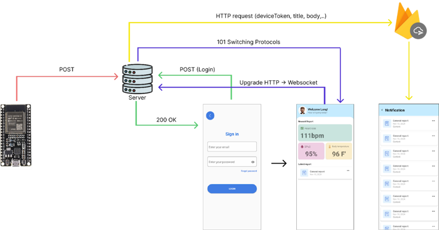

# NT131.P12

Đây là đồ án môn Hệ thống nhúng Mạng không dây với đề tài là triển khai FreeRTOS lên ESP32. Với đề này nhóm đã đề xuất hệ thống theo dõi sức khỏe bệnh nhân từ xa thông qua các cảm biến nhiệt độ MLX90614 và cảm biến biến nhịp tim MAX30102 để thu thập dữ liệu. Sau đó sẽ gửi thông tin về server, server tiếp nhận và gửi thông tin mobile app thông qua websocket để có thể thoi dõi từ xa. Nếu có dư liệu bất thường server sẽ gửi cảnh báo đến điện thoại thông qua Firebase Cloud Messaging.

### Tổng quan hệ thống

  

  

Luồng hoạt động nó sẽ diễn ra như sau:

- Tại ESP32, cảm biến nhiệt độ và cảm biến nhịp sẽ được thu thập thông qua các Task của FreeRTOS sau đó sẽ gửi đến server thông qua giao thức HTTP bằng phương thức POST.
- Ở phía mobile app sẽ tiến hành đăng nhập bằng username và password, sau khi nhận được sẽ gửi 1 requesst nâng cấp từ HTTP lên thành websocket để có thể nhận dữ liệu real-time từ server và hiển thị lên cho người dùng xem.
- Khi có dữ liệu bất thường như nhiệt độ quá cao, nộng đồ oxi thấp, nhịp tim quá cao hoặc quá thấp thì server sẽ sử dụng Firebase Cloud Messaging để gửi cảnh báo đến điện thoại để thông báo về các trường hợp bất thường.
